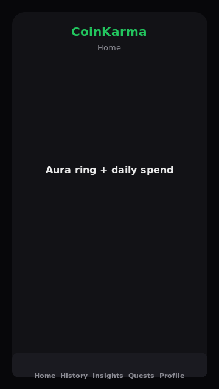
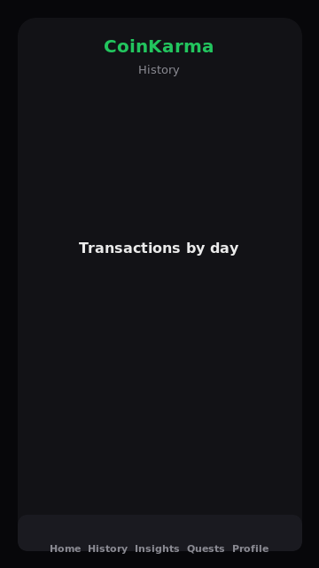
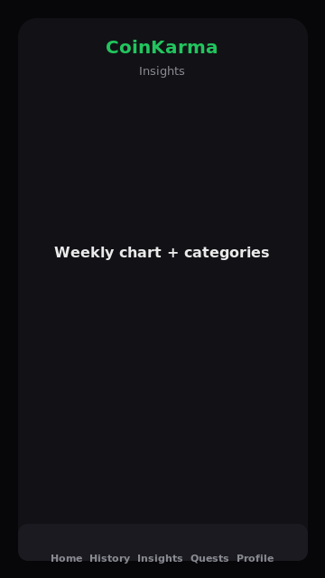
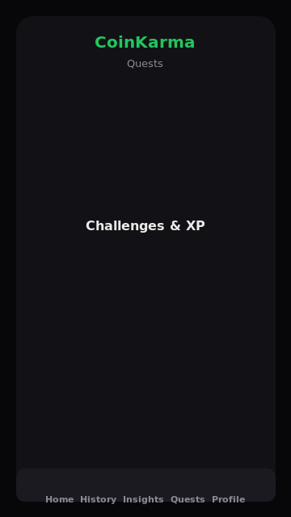
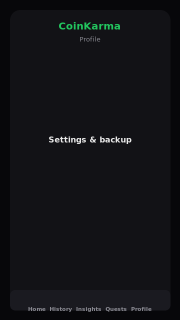
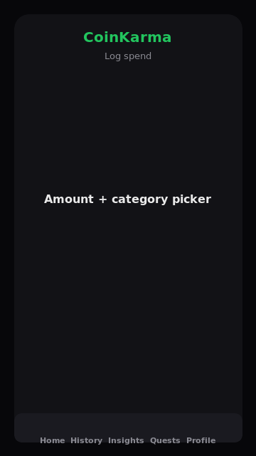

# CoinKarma

A personal finance tracker for Indian users built with Kotlin + Jetpack Compose. CoinKarma auto-detects spends from bank SMS messages, visualises your daily budget as an animated "aura ring", and turns saving habits into quests with XP rewards.

---

## Screenshots

| Home | History | Insights |
|:---:|:---:|:---:|
|  |  |  |

| Quests | Profile | Log spend |
|:---:|:---:|:---:|
|  |  |  |

> Screenshots show the Forest dark palette (default). Light mode and other palettes are available via Profile → Dark mode toggle.

---

## Features

- **Aura ring** — animated `Canvas` arc that tracks today's spend vs your daily budget; pulses and shifts colour (green → amber → red) as the limit approaches
- **SMS auto-detection** — reads Indian bank SMS (HDFC, ICICI, SBI, Axis, Kotak, PayTM, GPay) and inserts transactions automatically; runs entirely on-device, nothing is uploaded
- **Manual log** — bottom sheet with amount keypad, 7-category emoji picker, and optional merchant note
- **History** — transactions grouped by day with delete
- **Insights** — weekly bar chart + per-category spend breakdown
- **Quests** — gamified saving challenges (zero-spend days, category budgets) with rarity tiers and XP
- **Google Drive backup** — exports the full Room database as JSON to the user's private `appDataFolder`; nightly sync via WorkManager on Wi-Fi
- **Dark/light theme** — Forest palette by default; toggle from Profile, persisted to Room and applied live

---

## Tech stack

| Layer | Library / tool |
|---|---|
| UI | Jetpack Compose, Material3 |
| Navigation | Navigation Compose 2.8 |
| State | ViewModel + StateFlow |
| Persistence | Room 2.6 (KSP) |
| Async | Kotlin Coroutines + Flow |
| Image loading | Coil 2 |
| Background | WorkManager 2.9 |
| Backup | Google Drive API v3 (`appDataFolder` scope) |
| Auth | Google Sign-In (Play Services) |
| Build | Kotlin 2.0.21, AGP 8.5, Gradle 8.9 |

---

## Project structure

```
CoinKarma/
├── .github/
│   └── workflows/
│       ├── ci.yml            # build + lint + unit tests on every push/PR
│       └── release.yml       # builds release APK, creates GitHub Release on v* tag
├── app/
│   └── src/
│       ├── main/
│       │   ├── AndroidManifest.xml
│       │   ├── java/com/coinkarma/app/
│       │   │   ├── CoinKarmaApp.kt         # Application — DB init, notification channels, WorkManager schedule
│       │   │   ├── MainActivity.kt         # Single activity — reads darkMode from DB, drives theme
│       │   │   ├── backup/
│       │   │   │   ├── BackupWorker.kt     # CoroutineWorker — nightly Drive backup, UNMETERED constraint
│       │   │   │   └── DriveBackupManager.kt  # Sign-in, backupNow (JSON → appDataFolder), restoreNow + importJson
│       │   │   ├── data/
│       │   │   │   ├── CoinKarmaDatabase.kt   # Room @Database, version 1
│       │   │   │   ├── Daos.kt                # TransactionDao, CustomQuestDao, UserProfileDao
│       │   │   │   └── Entities.kt            # TransactionEntity, CustomQuestEntity, UserProfile
│       │   │   ├── sms/
│       │   │   │   ├── SmsParser.kt       # Regex heuristics for Indian bank SMS formats
│       │   │   │   └── SmsReceiver.kt     # BroadcastReceiver → DAO insert → notification
│       │   │   └── ui/
│       │   │       ├── CoinKarmaApp.kt    # Root composable — NavHost + bottom nav
│       │   │       ├── challenges/
│       │   │       │   ├── ChallengesScreen.kt
│       │   │       │   └── ChallengesViewModel.kt
│       │   │       ├── history/
│       │   │       │   ├── HistoryScreen.kt
│       │   │       │   └── HistoryViewModel.kt
│       │   │       ├── home/
│       │   │       │   ├── HomeScreen.kt       # Aura ring, stat pills, recent tx list
│       │   │       │   └── HomeViewModel.kt
│       │   │       ├── insights/
│       │   │       │   ├── InsightsScreen.kt   # Weekly bar chart, category breakdown
│       │   │       │   └── InsightsViewModel.kt
│       │   │       ├── log/
│       │   │       │   └── LogSheet.kt         # ModalBottomSheet — amount + category + note
│       │   │       ├── profile/
│       │   │       │   ├── ProfileScreen.kt    # Dark mode, budget, SMS toggle w/ rationale dialog
│       │   │       │   └── ProfileViewModel.kt
│       │   │       └── theme/
│       │   │           ├── Theme.kt            # CkPalette, ForestDark/Light, CoinKarmaTheme
│       │   │           └── Typography.kt       # Type scale (Space Grotesk / Inter / JetBrains Mono stubs)
│       │   └── res/
│       │       ├── values/
│       │       │   ├── colors.xml    # XML colour aliases (used by the splash/status-bar theme)
│       │       │   ├── strings.xml
│       │       │   └── themes.xml    # NoActionBar XML theme for splash/status bar
│       │       └── mipmap-*/         # Launcher icons (mdpi → xxxhdpi)
│       └── test/
│           └── java/com/coinkarma/app/sms/
│               └── SmsParserTest.kt  # 16 unit-test fixtures (HDFC/ICICI/SBI/Axis/Kotak/PayTM/GPay)
├── gradle/
│   └── wrapper/
│       ├── gradle-wrapper.jar
│       └── gradle-wrapper.properties  # Gradle 8.9
├── build.gradle.kts      # Root build — plugin versions
├── app/build.gradle.kts  # App module — all dependencies inlined
├── settings.gradle.kts
├── gradle.properties     # AndroidX, Kotlin code style flags
├── gradlew               # Unix wrapper script
├── CHANGELOG.md
└── README.md
```

---

## Prerequisites

| Tool | Version |
|---|---|
| JDK | 17 (Temurin / OpenJDK) |
| Android SDK | Platform 34, Build-Tools 34.0.0 |
| Gradle | 8.9 (via wrapper — no local install needed) |

**Set `ANDROID_HOME`** to point at your SDK directory before building:

```bash
# Linux / macOS — add to ~/.bashrc or ~/.zshrc
export ANDROID_HOME=$HOME/Android/Sdk
export PATH=$ANDROID_HOME/cmdline-tools/latest/bin:$PATH
```

If you don't have the Android SDK, install the command-line tools:

```bash
# Download from https://developer.android.com/studio#command-line-tools-only
# then:
mkdir -p $HOME/Android/Sdk/cmdline-tools
unzip commandlinetools-linux-*.zip -d $HOME/Android/Sdk/cmdline-tools/
mv $HOME/Android/Sdk/cmdline-tools/cmdline-tools $HOME/Android/Sdk/cmdline-tools/latest

sdkmanager "platforms;android-34" "build-tools;34.0.0" "platform-tools"
```

---

## Build

### Debug APK

```bash
git clone https://github.com/subhajitp/CoinKarma.git
cd CoinKarma
./gradlew assembleDebug
# APK → app/build/outputs/apk/debug/app-debug.apk
```

### Install directly to a connected device

```bash
./gradlew installDebug
```

### Run unit tests

```bash
./gradlew testDebugUnitTest
# Report → app/build/reports/tests/testDebugUnitTest/index.html
```

### Release APK

```bash
./gradlew assembleRelease
# APK → app/build/outputs/apk/release/app-release-unsigned.apk
```

To sign the release APK, create `keystore.properties` in the project root (this file is gitignored):

```properties
storeFile=/path/to/your.jks
storePassword=your_store_password
keyAlias=your_key_alias
keyPassword=your_key_password
```

Then update `app/build.gradle.kts` to wire the signing config (see the [Android signing docs](https://developer.android.com/studio/publish/app-signing)).

---

## Releases

Releases are published automatically by the [release workflow](.github/workflows/release.yml) when a `v*` tag is pushed:

```bash
git tag v0.2.0
git push origin v0.2.0
```

The workflow:
1. Runs unit tests
2. Builds a release APK
3. Signs it (if `KEYSTORE_FILE`, `KEYSTORE_PASSWORD`, `KEY_ALIAS`, `KEY_PASSWORD` secrets are set in the repo settings)
4. Extracts the matching section from `CHANGELOG.md` as release notes
5. Creates a GitHub Release and uploads the APK as an asset

Download the latest APK from the [Releases page](https://github.com/subhajitp/CoinKarma/releases).

---

## SMS permission note

`RECEIVE_SMS` and `READ_SMS` are [restricted permissions](https://support.google.com/googleplay/android-developer/answer/9888170). If you publish to the Play Store:

- Set the app category to **Finance → Personal Finance**
- Justify the SMS use case in the Play Console declaration
- The app already supports a fallback manual-entry-only mode — `SmsReceiver` simply won't fire if the user doesn't grant the permission

---

## Google Drive backup

Backup uses the `DRIVE_APPDATA` scope, which gives access only to a hidden `appDataFolder` folder invisible in the user's normal Drive UI. It does **not** trigger the broader Drive scope review.

Backup is triggered:
- Automatically each night by `BackupWorker` (requires unmetered network)
- Manually from the Profile screen → Connect Google → Backup now *(UI not yet wired — PR welcome)*

---

## Contributing

1. Fork the repo and create a branch: `git checkout -b feature/your-feature`
2. Follow the existing code style (no Hilt, no extra abstractions, one ViewModel per screen)
3. Add or update unit tests for any logic changes
4. Open a PR against `main`

---

## License

MIT — see [LICENSE](LICENSE).
